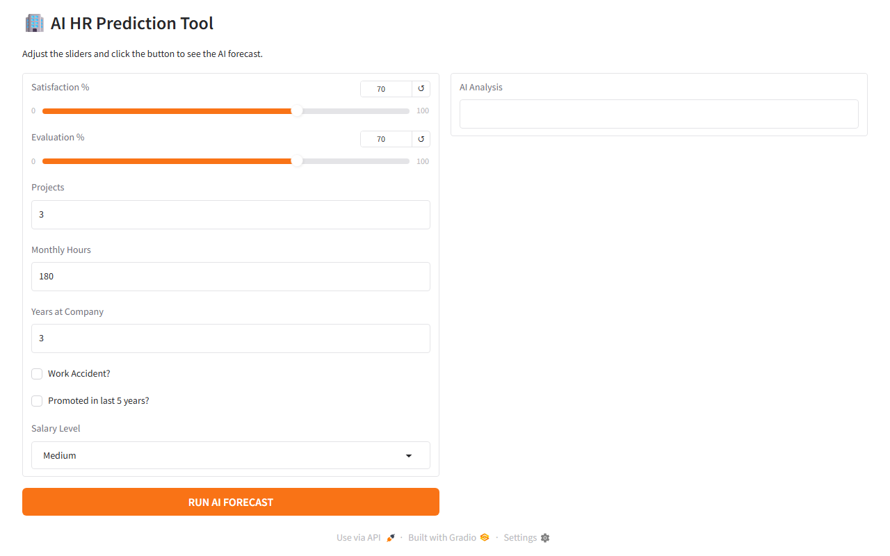

# HR Employee Attrition Predictor

An AI tool that predicts whether an employee is likely to leave a company. Built with a Multi-Layer Perceptron neural network trained on real HR data, with a Gradio web interface for live predictions.

## Demo



## How It Works

1. **Train** (`python1.py`) — loads the HR dataset, encodes categorical columns, trains a 2-layer MLP `(6, 5)`, and saves the model to `models/hr_model.pkl`
2. **Predict via UI** (`Frontend.py`) — launches a Gradio web app where you adjust employee stats and click **RUN AI FORECAST**
3. **Predict via CLI** (`use_the_brain.py`) — loads the saved model and runs a quick command-line prediction

The backpropagation math is also implemented from scratch in `backprop_python2.py` (sigmoid, derivatives, weight updates) as a learning reference alongside the Scikit-Learn version.

## Getting Started

```bash
pip install -r requirements.txt
python Frontend.py
```

Then open the local URL shown in the terminal (usually `http://127.0.0.1:7860`).

## Input Features

| Feature | Description |
|---|---|
| Satisfaction % | Employee satisfaction level (0–100) |
| Evaluation % | Last performance evaluation score (0–100) |
| Projects | Number of projects assigned |
| Monthly Hours | Average monthly working hours |
| Years at Company | Tenure in years |
| Work Accident | Whether the employee had a work accident |
| Promoted (last 5y) | Whether they were promoted in the last 5 years |
| Salary Level | Low / Medium / High |

## Output

- **STAY** — Employee is likely to remain
- **LEAVE** — Employee is at high risk of quitting

## Tech Stack

- [Python 3](https://www.python.org)
- [Scikit-Learn](https://scikit-learn.org) — MLPClassifier neural network
- [Gradio](https://gradio.app) — interactive web UI
- [Pandas](https://pandas.pydata.org) / [NumPy](https://numpy.org) — data processing
- [Joblib](https://joblib.readthedocs.io) — model serialization
